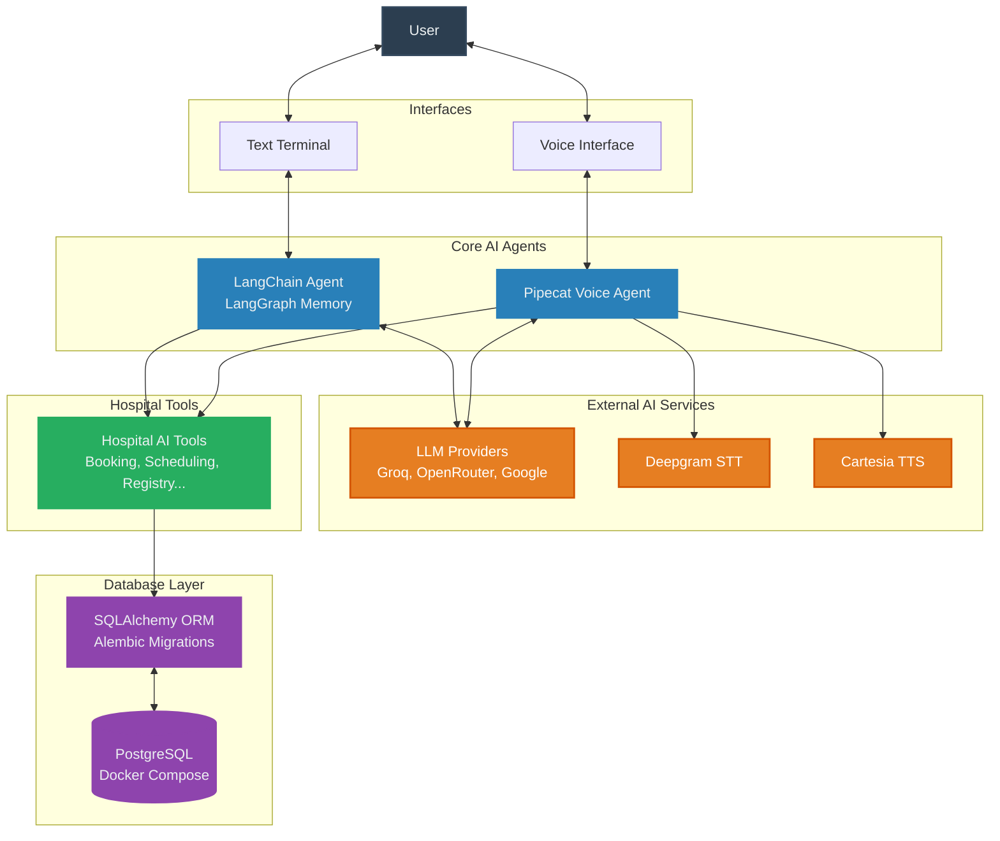

# Hospital Management AI Assistant

## Overview
This repository contains an intelligent Hospital Management AI system designed to streamline healthcare operations. It features two primary AI interfaces capable of managing patient records, arranging appointments, and delivering hospital information through text and voice interactions.

## Architecture
The system uses a highly modular architecture that integrates relational databases, generative artificial intelligence, and real-time voice transport technologies.



### 1. Database Layer
Built on PostgreSQL (managed via Docker Compose), this layer utilizes SQLAlchemy as the Object-Relational Mapper (ORM) and Alembic for schema migrations. The core entities include `Doctor`, `Patient`, `Appointment`, and `Calendar`.

### 2. Text-Based Agent (LangChain)
Located at `src/backend/langchain_agent.py`, this is a LangChain and LangGraph powered conversational assistant. It leverages LLMs (Groq, OpenRouter, Google) to execute complex hospital management workflows. It retains conversational memory via a state checkpointing system. It provides standard operating procedures for registration, booking, and cancellation.

### 3. Voice-Based Agent (Pipecat)
Located at `src/backend/voice_agent.py`, this real-time voice communication pipeline is built using the Pipecat framework. It uses Deepgram for Speech-to-Text (STT) and Cartesia for Text-to-Speech (TTS). It integrates local tool execution and LLM decision-making to seamlessly manage database operations through spoken conversation.

### 4. Data Initialization
An asynchronous script (`seed_db.py`) is provided to automatically populate the PostgreSQL database with comprehensive, realistic mock data for easy setup and testing.

## Workflows & Standard Operating Procedures
Both the text and voice agents share strict, predefined workflow execution paths:
*   **New Patient Registration**: Systematically collects demographics and registers the patient securely.
*   **Appointment Booking**: Validates doctor schedules, checks accurate availability, requests required visit details, and schedules appointments.
*   **Appointment Cancellations**: Uses patient records to check historical schedules prior to validating and confirming cancellations.
*   **Emergency Handling**: Includes an emergency override to direct patients to emergency services for life-threatening descriptions.

## Prerequisites
* Python 3.9+
* Docker and Docker Compose
* Appropriate API keys for external services (Deepgram, Cartesia, Groq, OpenRouter, etc.)

## Setup Instructions

1. **Environment Configuration**: Create a `.env` file in the root directory and configure the required API keys corresponding to `config.py` (e.g., GROQ_API_KEY, CARTESIA_API_KEY, DEEPGRAM_API_KEY).
2. **Start the Database**:
    Use Docker Compose to spin up the PostgreSQL instance.
    ```bash
    docker-compose up -d
    ```
3. **Install Dependencies**:
    Install all required Python packages.
    ```bash
    pip install -r requirements.txt
    ```
4. **Seed the Database**:
    Initialize the database schemas and populate them with the initial mock data.
    ```bash
    python seed_db.py
    ```

## Usage

### Using the Text Chat Agent
To interact via text in your terminal:
```bash
python src/backend/langchain_agent.py
```

### Using the Voice Agent
To launch the real-time voice bot:
```bash
python src/backend/voice_agent.py
```
